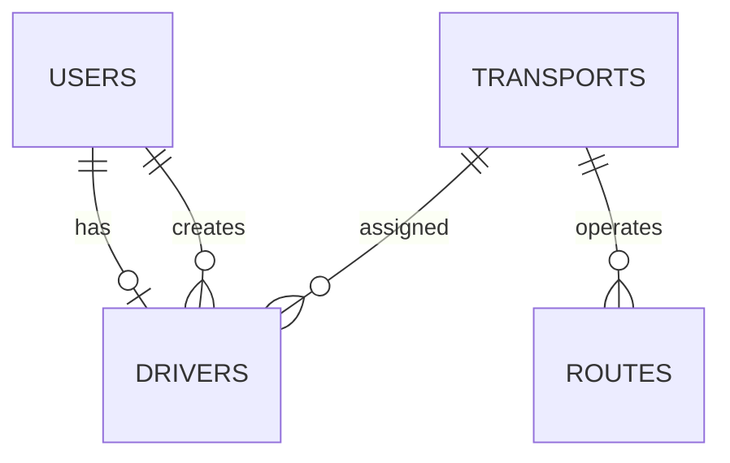

# Database Documentation

## Overview

LlegoYa uses **PostgreSQL** as its relational database and **Prisma ORM** for data management. MongoDB is additionally used to store AI conversation logs.

## Main Tables

### Users

Stores all registered users.

| Field           | Type                      |
| --------------- | ------------------------- |
| id              | Integer                   |
| fullname        | String                    |
| email           | String                    |
| password        | String                    |
| phone           | String                    |
| document_number | String                    |
| role            | USER, DRIVER, SUPER_ADMIN |
| is_active       | Boolean                   |
| created_at      | Timestamp                 |
| updated_at      | Timestamp                 |

---

### Drivers

Contains additional information for users with the DRIVER role.

| Field              | Type    |
| ------------------ | ------- |
| id                 | Integer |
| user_id            | Integer |
| transport_id       | Integer |
| license_type       | String  |
| experience_years   | Integer |
| license_expiration | Date    |
| created_by         | Integer |

---

### Transports

Stores the available public transport vehicles.

| Field     | Type    |
| --------- | ------- |
| id        | Integer |
| plate     | String  |
| model     | String  |
| capacity  | Integer |
| is_active | Boolean |

---

### Routes

Stores transportation routes.

| Field        | Type    |
| ------------ | ------- |
| id           | Integer |
| origin       | String  |
| destination  | String  |
| transport_id | Integer |

---

## Application Models

### Route

Represents a route displayed on the interactive map.

| Field       | Type   |
| ----------- | ------ |
| id          | string |
| name        | string |
| startPoint  | object |
| endPoint    | object |
| distance    | number |
| duration    | number |
| color       | string |
| coordinates | Array  |
| stops       | Stop[] |

### Stop

Represents a bus stop within a route.

| Field    | Type   |
| -------- | ------ |
| id       | string |
| name     | string |
| lat      | number |
| lng      | number |
| sequence | number |

---

## Relationships

- One User may have one Driver profile.
- One Driver can be assigned to one Transport.
- One Transport can operate multiple Routes.
- Super Administrators manage drivers and transports.

## Entity Relationship Diagram

