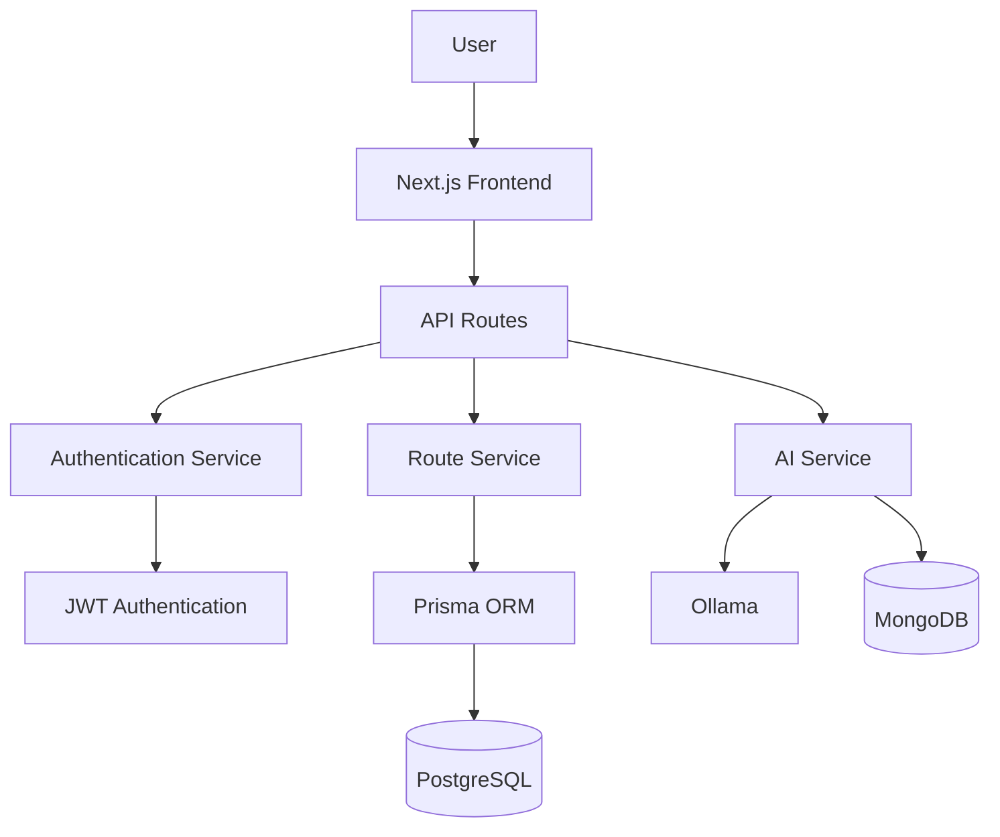
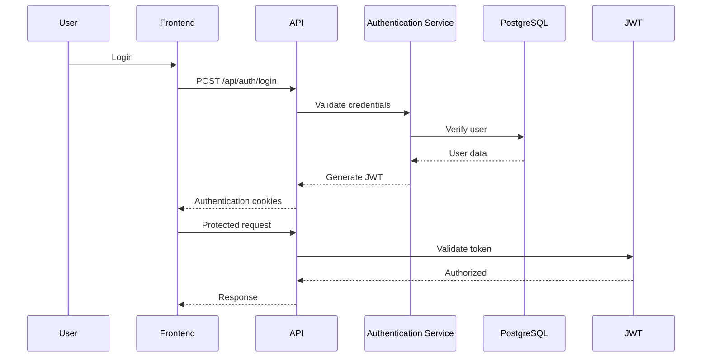

# System Architecture

## Overview

LlegoYa follows a modular full-stack architecture using Next.js App Router. The application separates the user interface, business logic, authentication, AI services, and database access into independent layers, allowing the platform to be scalable and maintainable.

## Component Diagram



---

## Authentication Flow



---

## AI Assistant Flow

```mermaid
flowchart LR

User

-->

Chat Interface

-->

API Chat

-->

AI Service

-->

Ollama

-->

Response

-->

MongoDB Logs
```

---

## Main Components

| Component              | Responsibility                               |
| ---------------------- | -------------------------------------------- |
| Frontend               | User interface and interactive maps          |
| API Routes             | Handle HTTP requests                         |
| Authentication Service | Login, registration, token management        |
| Route Service          | Transport route management                   |
| AI Service             | AI-powered mobility recommendations          |
| Prisma ORM             | Database access layer                        |
| PostgreSQL             | Stores users, drivers, transports and routes |
| MongoDB                | Stores AI interaction logs                   |
