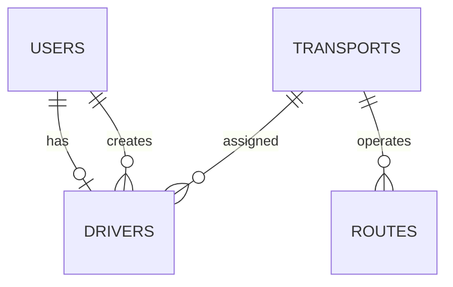

# Documentación de la Base de Datos

## Descripción General

LlegoYa utiliza **PostgreSQL** como base de datos relacional y **Prisma ORM** para la gestión de los datos. Adicionalmente, se utiliza **MongoDB** para almacenar los registros de las conversaciones del asistente de inteligencia artificial.

## Tablas Principales

### Usuarios

Almacena todos los usuarios registrados.

| Campo           | Tipo                      |
| --------------- | ------------------------- |
| id              | Integer                   |
| fullname        | String                    |
| email           | String                    |
| password        | String                    |
| phone           | String                    |
| document_number | String                    |
| role            | USER, DRIVER, SUPER_ADMIN |
| is_active       | Boolean                   |
| created_at      | Timestamp                 |
| updated_at      | Timestamp                 |

---

### Conductores

Contiene información adicional para los usuarios con el rol **DRIVER**.

| Campo              | Tipo    |
| ------------------ | ------- |
| id                 | Integer |
| user_id            | Integer |
| transport_id       | Integer |
| license_type       | String  |
| experience_years   | Integer |
| license_expiration | Date    |
| created_by         | Integer |

---

### Transportes

Almacena los vehículos de transporte público disponibles.

| Campo     | Tipo    |
| --------- | ------- |
| id        | Integer |
| plate     | String  |
| model     | String  |
| capacity  | Integer |
| is_active | Boolean |

---

### Rutas

Almacena las rutas de transporte.

| Campo        | Tipo    |
| ------------ | ------- |
| id           | Integer |
| origin       | String  |
| destination  | String  |
| transport_id | Integer |

---

## Modelos de la Aplicación

### Route

Representa una ruta mostrada en el mapa interactivo.

| Campo       | Tipo   |
| ----------- | ------ |
| id          | string |
| name        | string |
| startPoint  | object |
| endPoint    | object |
| distance    | number |
| duration    | number |
| color       | string |
| coordinates | Array  |
| stops       | Stop[] |

### Stop

Representa una parada de autobús dentro de una ruta.

| Campo    | Tipo   |
| -------- | ------ |
| id       | string |
| name     | string |
| lat      | number |
| lng      | number |
| sequence | number |

---

## Relaciones

- Un **Usuario** puede tener un **perfil de Conductor**.
- Un **Conductor** puede estar asignado a un **Transporte**.
- Un **Transporte** puede operar múltiples **Rutas**.
- Los **Superadministradores** administran los conductores y los transportes.

## Diagrama Entidad-Relación

