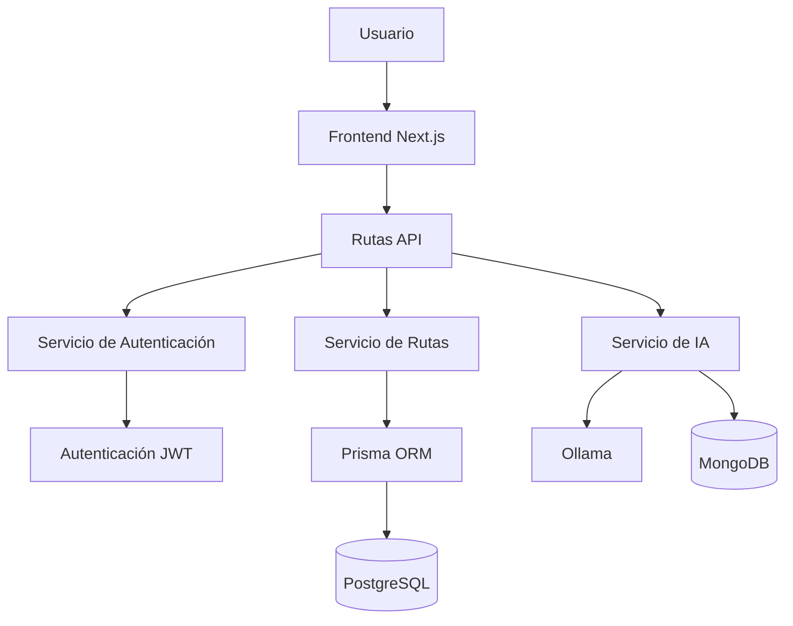
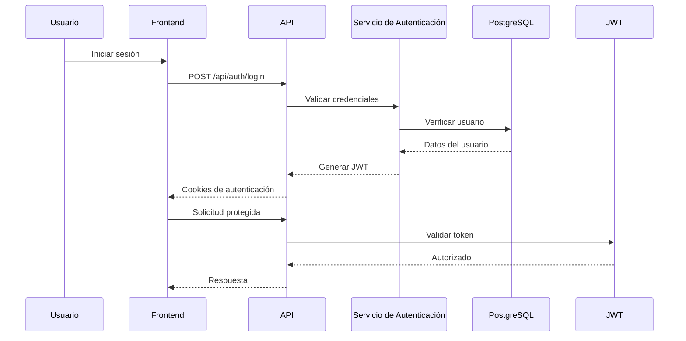

# Arquitectura del Sistema

## Descripción General

LlegoYa sigue una arquitectura **Full Stack** modular utilizando **Next.js App Router**. La aplicación separa la interfaz de usuario, la lógica de negocio, la autenticación, los servicios de inteligencia artificial y el acceso a la base de datos en capas independientes, lo que permite que la plataforma sea escalable y fácil de mantener.

## Diagrama de Componentes



---

## Flujo de Autenticación



---

## Flujo del Asistente de IA

```mermaid
flowchart LR

Usuario

-->

Interfaz de Chat

-->

API Chat

-->

Servicio de IA

-->

Ollama

-->

Respuesta

-->

Registros en MongoDB
```

---

## Componentes Principales

| Componente                | Responsabilidad                                                     |
| ------------------------- | ------------------------------------------------------------------- |
| Frontend                  | Interfaz de usuario y mapas interactivos                            |
| Rutas API                 | Gestionar las solicitudes HTTP                                      |
| Servicio de Autenticación | Inicio de sesión, registro y gestión de tokens                      |
| Servicio de Rutas         | Gestión de las rutas de transporte                                  |
| Servicio de IA            | Recomendaciones de movilidad impulsadas por inteligencia artificial |
| Prisma ORM                | Capa de acceso a la base de datos                                   |
| PostgreSQL                | Almacena usuarios, conductores, transportes y rutas                 |
| MongoDB                   | Almacena los registros de las interacciones con la IA               |
